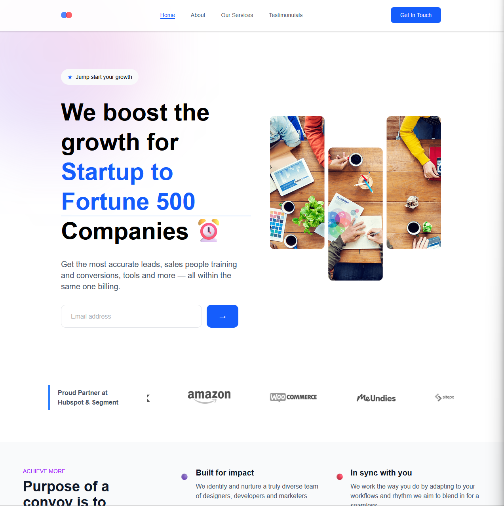

---

## 🚀 Overview

A modern and fully responsive landing page built using **React.js**, **Tailwind CSS**, and **Framer Motion**, designed to deliver an engaging user experience with smooth animations and sleek visual design. This project is ideal for showcasing products, services, or startups.

---

<div align="center">
  <div>
    
    
    
    
  </div>

  <h3 align="center">🚀 React Landing Page with Modern UI/UX</h3>
</div>


---

## 🌄 Image Preview

* **Homepage Preview:**
  

---

## 🌟 Key Features

* ✅ **Modern & Minimal UI Design**
  Clean layout with a focus on readability and smooth flow.

* ✅ **Fully Responsive**
  Optimized for mobile, tablet, and desktop devices.

* ✅ **Framer Motion Animations**
  Beautiful motion effects for section entrances and interactions.

* ✅ **Testimonials Carousel**
  Show real feedback from users or clients.

* ✅ **Newsletter Subscription**
  Simple form to collect user emails.

* ✅ **Trusted by Brands Section**
  Show off company/client logos.

* ✅ **Interactive Pricing Calculator**
  Helps users estimate pricing dynamically.

* ✅ **Modular Services Section**
  Highlight key offerings or capabilities.

* ✅ **Reusable Components**
  Clean code structure for easier maintenance and scalability.

---

## 🛠️ Built With

* ⚛️ **React.js** – Component-based JavaScript library
* 🎨 **Tailwind CSS** – Utility-first CSS framework
* 🌀 **Framer Motion** – Animation library for React
* 🔁 **Swiper.js** – Modern mobile touch slider
* 🎯 **React Icons** – Icon library for React applications

---

## 📦 Getting Started

To get a local copy up and running follow these simple steps:

### 1. Clone the repository

```bash
git clone https://github.com/samirzjadhav/react-landing-page.git
```

### 2. Navigate to the project folder

```bash
cd react-landing-page
```

### 3. Install dependencies

```bash
npm install
```

### 4. Start the development server

```bash
npm run dev
```

Visit the app at:
🌐 [http://localhost:5173](http://localhost:5173)

---

## 🌍 Live Demo

👉 [Live Website](https://react-landing-page-azure.vercel.app/)

---

## 💡 Use Cases

* SaaS Product Websites
* Tech Startup Landing Pages
* Marketing Agencies
* Portfolio Introductions
* Business or App Promotions

---

## 👨‍💻 Author

Made with ❤️ by [**Samir Z Jadhav**](https://samirj.vercel.app)

* 📬 [LinkedIn](https://linkedin.com/in/samirzjadhav)
* 🌐 [Portfolio](https://samirj.vercel.app)

---

## 🤝 Contributions

Contributions, issues, and feature requests are welcome!
Feel free to **fork** this project and submit a **pull request**.

---

## 📄 License

Distributed under the [MIT License](LICENSE).
You’re free to use, copy, modify, and distribute this project.

---

## 🙌 Acknowledgements

Inspired by modern web design trends and built as a personal project to explore component-based UIs with smooth animations and responsive layouts.

---


<!-- ## 🚀 Overview

A modern, responsive landing page built with **React.js**, **Tailwind CSS**, and **Framer Motion**, featuring smooth animations, interactive sections, and a clean UI/UX design.

---

## 🌟 Image Section

- **Image Section**:  
  

## 🌟 Features

* ✅ Modern and clean design
* ✅ Fully responsive layout
* ✅ Smooth animations with Framer Motion
* ✅ Interactive components
* ✅ Testimonials carousel
* ✅ Newsletter subscription form
* ✅ Company logo showcase
* ✅ Pricing calculator
* ✅ Services section

---

## 🛠️ Built With

* **React.js**
* **Tailwind CSS**
* **Framer Motion**
* **Swiper.js**
* **React Icons**

---

## 📦 Getting Started

1. **Clone the repository**

   ```bash
   git clone https://github.com/samirzjadhav/react-landing-page.git
   ```

2. **Install dependencies**

   ```bash
   npm install
   ```

3. **Run the development server**

   ```bash
   npm start
   ```

4. **Visit in your browser**
   [http://localhost:5173](http://localhost:5173)

---

## 🌍 Live Demo

🔗 [Live Website](https://react-landing-page-azure.vercel.app/)

---

## 👨‍💻 Author

Made with ❤️ by [**Samir Z Jadhav**](https://samirj.vercel.app)

---

## 📄 License

Licensed under the [MIT License](LICENSE).

---

 -->
